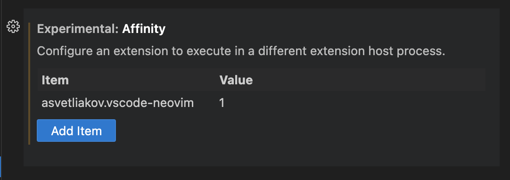

<h2 align="center"><br>VSCode Neovim</h2>
<p align="center"><strong>VSCode Neovim Integration</strong></p>

<p align=center>
<a href="https://marketplace.visualstudio.com/items?itemName=asvetliakov.vscode-neovim"></a>
<a href="https://github.com/asvetliakov/vscode-neovim/actions/workflows/build_test.yml"></a>
<a href="https://gitter.im/vscode-neovim/community?utm_source=badge&utm_medium=badge&utm_campaign=pr-badge"></a>
</p>

[Neovim](https://neovim.io/) is a fork of VIM to allow greater extensibility and integration. This extension uses a
fully embedded Neovim instance, no more half-complete VIM emulation! VSCode's native functionality is used for insert
mode and editor commands, making the best use of both editors.

-   🎉 Almost fully feature-complete VIM integration by utilizing Neovim as a backend.
-   🔧 Supports custom `init.vim` and many VIM plugins.
-   🥇 First-class and lag-free insert mode, letting VSCode do what it does best.
-   🤝 Complete integration with VSCode features (lsp/autocompletion/snippets/multi-cursor/etc).

<strong>Table of Contents</strong>

-   [🧰 Getting Started](#-getting-started)
    -   [Installation](#installation)
    -   [Neovim configuration](#neovim-configuration)
    -   [VSCode configuration](#vscode-configuration)
    -   [Adding keybindings](#adding-keybindings)
-   [💡 Tips and Features](#-tips-and-features)
    -   [VSCode specific differences](#vscode-specific-differences)
    -   [Troubleshooting](#troubleshooting)
        -   [Performance problems](#performance-problems)
    -   [Composite escape keys](#composite-escape-keys)
    -   [Jumplist](#jumplist)
    -   [Wildmenu completion](#wildmenu-completion)
    -   [Multiple cursors](#multiple-cursors)
    -   [Invoking VSCode actions from neovim](#invoking-vscode-actions-from-neovim)
        -   [Examples](#examples)
-   [⌨️ Bindings](#️-bindings)
    -   [VSCode specific bindings](#vscode-specific-bindings)
        -   [Editor command](#editor-command)
        -   [Explorer/list navigation](#explorerlist-navigation)
        -   [Explorer file manipulation](#explorer-file-manipulation)
    -   [File management](#file-management)
    -   [Tab management](#tab-management)
    -   [Buffer/window management](#bufferwindow-management)
    -   [Insert mode special keys](#insert-mode-special-keys)
    -   [Normal mode control keys](#normal-mode-control-keys)
    -   [Cmdline special keys](#cmdline-special-keys)
-   [🔧 Build](#-build)
-   [📑 How it works](#-how-it-works)
-   [❤️ Credits \& External Resources](#️-credits--external-resources)

</details>

## 🧰 Getting Started

### Installation

-   Install the [vscode-neovim](https://marketplace.visualstudio.com/items?itemName=asvetliakov.vscode-neovim)
    extension.
-   Install [Neovim](https://github.com/neovim/neovim/wiki/Installing-Neovim) **0.8.0** or greater.
    -   Set the Neovim path in the extension settings. You must specify full path to Neovim, like
        "`C:\Neovim\bin\nvim.exe`" or "`/usr/local/bin/nvim`".
    -   The setting id is "`vscode-neovim.neovimExecutablePaths.win32/linux/darwin`", respective to your system.
-   If you want to use Neovim from WSL, set the `useWSL` configuration toggle and specify Linux path to nvim binary.
    `wsl.exe` Windows binary and `wslpath` Linux binary are required for this. `wslpath` must be available through
    `$PATH` Linux env setting. Use `wsl --list` to check for the correct default Linux distribution.
-   Assign [affinity](#affinity) value for performance improvement.

    -   Settings > Features > Extensions > Experimental Affinity.

            Assign value 1 for entry `asvetliakov.vscode-neovim`
            

        OR

    -   Add to your `settings.json`:
        ```json
        "extensions.experimental.affinity": {
            "asvetliakov.vscode-neovim": 1
        },
        ```

### Neovim configuration

Since many VIM plugins can cause issues in VSCode, it is recommended to start from an empty `init.vim`. For a guide for
which types of plugins are supported, see [troubleshooting](#troubleshooting).

Before creating an issue on Github, make sure you can reproduce the problem with an empty `init.vim` and no VSCode
extensions.

To determine if Neovim is running in VSCode, add to your `init.vim`:

```vim
if exists('g:vscode')
    " VSCode extension
else
    " ordinary Neovim
endif
```

Or to your `init.lua`:

```lua
if vim.g.vscode then
    -- VSCode extension
else
    -- ordinary Neovim
end
```

To conditionally activate plugins, `vim-plug` has a
[few solutions](https://github.com/junegunn/vim-plug/wiki/tips#conditional-activation). `packer.nvim` and `lazy.nvim`
have built-in support for `cond = vim.g.vscode`. See
[plugins](https://github.com/vscode-neovim/vscode-neovim/wiki/Plugins) in the wiki for tips on configuring VIM plugins.

### VSCode configuration

-   On a Mac, the <kbd>h</kbd>, <kbd>j</kbd>, <kbd>k</kbd> and <kbd>l</kbd> movement keys may not repeat when held, to
    fix this open Terminal and execute the following command:
    `defaults write com.microsoft.VSCode ApplePressAndHoldEnabled -bool false`.
-   To fix remapped escape key not working in Linux, set `"keyboard.dispatch": "keyCode"`

### Adding keybindings

Every special (control/alt) keyboard shortcut must be explicitly defined in VSCode to send to neovim. By default, only
bindings that are included by Neovim by default are sent.

To pass custom bindings to Neovim, for example <kbd>C-h</kbd> in normal mode, add to your keybindings.json:

```jsonc
{
    "command": "vscode-neovim.send",
    // the key sequence to activate the binding
    "key": "ctrl+h",
    // don't activate during insert mode
    "when": "editorTextFocus && neovim.mode != insert",
    // the input to send to Neovim
    "args": "<C-h>"
}
```

To disable an existing shortcut, for example <kbd>C-a</kbd>, add to your keybindings.json:

```json
{
    "command": "-vscode-neovim.send",
    "key": "ctrl+a"
}
```

The VSCode keybindings editor provides a good way to delete keybindings.

## 💡 Tips and Features

### VSCode specific differences

-   File and editor management commands such as `:e`/`:w`/`:q`/`:vsplit`/`:tabnext`/etc are mapped to corresponding
    VSCode commands and behavior may be different ([see below](#️-bindings)). **Do not** use vVIM commands like `:w` in
    scripts/keybindings, they won't work. If you're using them in some custom commands/mappings, you might need to
    rebind them to call VSCode commands from Neovim with `VSCodeCall/VSCodeNotify`
    ([see below](#invoking-vscode-actions-from-neovim)).
-   When you type some commands they may be substituted for the another, like `:write` will be replaced by `:Write`.
-   Scrolling is done by VSCode. <kbd>C-d</kbd>/<kbd>C-u</kbd>/etc are slightly different.
-   Editor customization (relative line number, scrolloff, etc) is handled by VSCode.
-   Dot-repeat (<kbd>.</kbd>) is slightly different - moving the cursor within a change range won't break the repeat.
    sequence. In Neovim, if you type `abc<cursor>` in insert mode, then move cursor to `a<cursor>bc` and type `1` here
    the repeat sequence would be `1`. However in VSCode it would be `a1bc`. Another difference is that when you delete
    some text in insert mode, dot repeat only works from right-to-left, meaning it will treat <kbd>Del</kbd> key as
    <kbd>BS</kbd> keys when running dot repeat.

### Troubleshooting

If you get "Unable to init vscode-neovim: command 'type' already exists" message, uninstall other VSCode extensions that
register the `type` command (like [VSCodeVim](https://marketplace.visualstudio.com/items?itemName=vscodevim.vim) or
[Overtype](https://marketplace.visualstudio.com/items?itemName=adammaras.overtype)).

#### Performance problems

##### Affinity

Make sure you have the extension running in its own thread using affinity (see [installation](#installation)).

Extensions that share the same affinity value are associated with a shared extension host (extension manager from
VSCode). Performance issues arise when a number of extensions have the same host. On going operations of one extension
may slow down the operations of another. However, if an extension is assigned an affinity, its extension host runs in a
separate worker thread. The operations of extension with host in one thread doesn't directly affect the operations of
extension with its host running in another.

##### Other Extensions

If you have any performance problems (cursor jitter usually) make sure you're not using these kinds of extensions:

-   Anything that renders decorators very often:
    -   Line number extensions (VSCode has built-in support for normal/relative line numbers)
    -   Indent guide extensions (VSCode has built-in indent guides)
    -   Brackets highlighter extensions (VSCode has built-in feature)
-   VSCode extensions that delay the extension host like "Bracket Pair Colorizer"
-   VIM plugins that increase latency and cause performance problems.
    -   Make sure to disable unneeded plugins, as many of them don't make sense with VSCode and may cause problems.
    -   You don't need any code, highlighting, completion, LSP plugins as well any plugins that spawn windows/buffers
        (nerdtree and similar), fuzzy-finders, etc.
    -   Many navigation/textobject/editing plugins should be fine.

If you're not sure, disable all other extensions, **reload VSCode window**, and see if the problem persists before
reporting it.

### Composite escape keys

Since VSCode is responsible for insert mode, custom insert-mode VIM mappings don't work. To map composite escape keys,
put into your keybindings.json:

for <kbd>jj</kbd>

```json
{
    "command": "vscode-neovim.compositeEscape1",
    "key": "j",
    "when": "neovim.mode == insert && editorTextFocus",
    "args": "j"
}
```

to enable <kbd>jk</kbd> add also:

```json
{
    "command": "vscode-neovim.compositeEscape2",
    "key": "k",
    "when": "neovim.mode == insert && editorTextFocus",
    "args": "k"
}
```

Currently, there is no way to map both `jk` and `kj`, or to map `jk` without also mapping `jj`.

### Jumplist

VSCode's jumplist is used instead of Neovim's. This is to make VSCode native navigation (mouse click, jump to
definition, etc) navigable through the jumplist.

Make sure to bind to `workbench.action.navigateBack` / `workbench.action.navigateForward` if you're using custom
mappings. Marks (both upper & lowercased) should work fine.

### Wildmenu completion

Command menu has the wildmenu completion on type. The completion options appear after 1.5s (to not bother you when you
write `:w` or `:noh`). <kbd>Up</kbd>/<kbd>Down</kbd> selects the option and <kbd>Tab</kbd> accepts it. See the gif:


### Multiple cursors

Multiple cursors work in:

1. Insert mode
2. Visual line mode
3. Visual block mode

To spawn multiple cursors from visual line/block modes type <kbd>ma</kbd>/<kbd>mA</kbd> or <kbd>mi</kbd>/<kbd>mI</kbd>
(by default). The effect differs:

-   For visual line mode, <kbd>mi</kbd> will start insert mode on each selected line on the first non whitespace
    character and <kbd>ma</kbd> will on the end of line.
-   For visual block mode, <kbd>mi</kbd> will start insert on each selected line before the cursor block and
    <kbd>ma</kbd> after.
-   <kbd>mA</kbd>/<kbd>mI</kbd> versions accounts for empty lines (only for visual line mode, for visual block mode
    they're same as <kbd>ma</kbd>/<kbd>mi</kbd>).

See gif in action:


### Invoking VSCode actions from neovim

There are a
[few helper functions](https://github.com/vscode-neovim/vscode-neovim/blob/master/vim/vscode-neovim.vim#L17-L39) that
are used to invoke VSCode commands from Neovim. Note that the commands that start with `require("vscode-neovim")` are
lua variants.

| Command                                                                                                                                                                                                                             | Description                                                                                                                                                                                   |
| ----------------------------------------------------------------------------------------------------------------------------------------------------------------------------------------------------------------------------------- | --------------------------------------------------------------------------------------------------------------------------------------------------------------------------------------------- |
| <ul><li>`VSCodeNotify(command, ...)`</li><li>`VSCodeCall`</li><li>`require("vscode-neovim").notify`</li> <li>`require("vscode-neovim").call`</li></ul>                                                                              | Invoke VSCode command with optional arguments.                                                                                                                                                |
| <ul><li>`VSCodeNotifyRange(command, line1, line2, leaveSelection, ...)` </li><li>`VSCodeCallRange`</li><li>`require("vscode-neovim").notify_range`</li><li>`require("vscode-neovim").call_range`</li></ul>                          | Produce linewise VSCode selection from `line1` to `line2` and invoke VSCode command. Setting `leaveSelection` to 1 keeps VSCode selection active after invoking the command. Line is 1-based. |
| <ul><li>`VSCodeNotifyRangePos(command, line1, line2, pos1, pos2, leaveSelection ,...)`</li><li>`VSCodeCallRangePos`</li><li>`require("vscode-neovim").notify_range_pos`</li><li>`require("vscode-neovim").call_range_pos`</li></ul> | Produce characterwise VSCode selection from `line1.pos1` to `line2.pos2` and invoke VSCode command. Pos is \[1,1\]-based.                                                                     |

> 💡 Functions with `Notify` in their name are non-blocking, the ones with `Call` are blocking. Generally **use Notify**
> unless you really need a blocking call. One example of a blocking call is wanting VSCode to process a visual selection
> when running a command before exiting visual mode.

#### Examples

Format selection (default binding):

```vim
xnoremap = <Cmd>call VSCodeCall('editor.action.formatSelection')<CR>
nnoremap = <Cmd>call VSCodeCall('editor.action.formatSelection')<CR><Esc>
nnoremap == <Cmd>call VSCodeCall('editor.action.formatSelection')<CR>
```

Open definition aside (default binding):

```vim
nnoremap <C-w>gd <Cmd>call VSCodeNotify('editor.action.revealDefinitionAside')<CR>
```

Find in files for word under cursor:

```vim
nnoremap ? <Cmd>call VSCodeNotify('workbench.action.findInFiles', { 'query': expand('<cword>')})<CR>
```

More advanced examples can be found [here](https://github.com/vscode-neovim/vscode-neovim/tree/master/vim).

## ⌨️ Bindings

These are the default commands and bindings available for file/scroll/window/tab management.

-   See [vscode-scrolling.vim](/vim/vscode-scrolling.vim) for scrolling commands reference
-   See [vscode-file-commands.vim](/vim/vscode-file-commands.vim) for file commands reference
-   See [vscode-tab-commands.vim](/vim/vscode-tab-commands.vim) for tab commands reference
-   See [vscode-window-commands.vim](/vim/vscode-window-commands.vim) for window commands reference

> 💡 "With bang" refers to adding a "!" to the end of a command.

### VSCode specific bindings

#### Editor command

| Key                                                         | VSCode Command                                                                                 |
| ----------------------------------------------------------- | ---------------------------------------------------------------------------------------------- |
| <kbd>=</kbd> / <kbd>==</kbd>                                | `editor.action.formatSelection`                                                                |
| <kbd>gh</kbd> / <kbd>K</kbd>                                | `editor.action.showHover`                                                                      |
| <kbd>gd</kbd> / <kbd>C-]</kbd>                              | `editor.action.revealDefinition` <br/> Also works in vim help.                                 |
| <kbd>gf</kbd>                                               | `editor.action.revealDeclaration`                                                              |
| <kbd>gH</kbd>                                               | `editor.action.referenceSearch.trigger`                                                        |
| <kbd>gO</kbd>                                               | `workbench.action.gotoSymbol`                                                                  |
| <kbd>C-w</kbd> <kbd>gd</kbd> / <kbd>C-w</kbd> <kbd>gf</kbd> | `editor.action.revealDefinitionAside`                                                          |
| <kbd>gD</kbd>                                               | `editor.action.peekDefinition`                                                                 |
| <kbd>gF</kbd>                                               | `editor.action.peekDeclaration`                                                                |
| <kbd>Tab</kbd>                                              | `togglePeekWidgetFocus` <br/> Switch between peek editor and reference list.                   |
| <kbd>C-n</kbd> / <kbd>C-p</kbd>                             | Navigate lists, parameter hints, suggestions, quick-open, cmdline history, peek reference list |

> 💡 To specify the default peek mode, modify `editor.peekWidgetDefaultFocus` in your settings.

#### Explorer/list navigation

| Key                                                   | VSCode Command                  |
| ----------------------------------------------------- | ------------------------------- |
| <kbd>j</kbd> / <kbd>k</kbd>                           | `list.focusDown/Up`             |
| <kbd>h</kbd> / <kbd>l</kbd>                           | `list.collapse/select`          |
| <kbd>Enter</kbd>                                      | `list.select`                   |
| <kbd>gg</kbd>                                         | `list.focusFirst`               |
| <kbd>G</kbd>                                          | `list.focusLast`                |
| <kbd>o</kbd>                                          | `list.toggleExpand`             |
| <kbd>C-u</kbd> / <kbd>C-d</kbd>                       | `list.focusPageUp/Down`         |
| <kbd>z</kbd> <kbd>o</kbd> / <kbd>z</kbd> <kbd>O</kbd> | `list.expand`                   |
| <kbd>z</kbd> <kbd>c</kbd>                             | `list.collapse`                 |
| <kbd>z</kbd> <kbd>C</kbd>                             | `list.collapseAllToFocus`       |
| <kbd>z</kbd> <kbd>a</kbd> / <kbd>z</kbd> <kbd>A</kbd> | `list.toggleExpand`             |
| <kbd>z</kbd> <kbd>m</kbd> / <kbd>z</kbd> <kbd>M</kbd> | `list.collapseAll`              |
| <kbd> / </kbd> / <kbd>Escape</kbd>                    | `list.toggleKeyboardNavigation` |

#### Explorer file manipulation

| Key          | VSCode Command        |
| ------------ | --------------------- |
| <kbd>r</kbd> | `renameFile`          |
| <kbd>d</kbd> | `deleteFile`          |
| <kbd>y</kbd> | `filesExplorer.copy`  |
| <kbd>x</kbd> | `filesExplorer.cut`   |
| <kbd>p</kbd> | `filesExplorer.paste` |
| <kbd>v</kbd> | `explorer.openToSide` |
| <kbd>a</kbd> | `explorer.newFile`    |
| <kbd>A</kbd> | `explorer.newFolder`  |

### File management

| Command                                                                              | Description                                                                                                                                                                                                                                                                                    |
| ------------------------------------------------------------------------------------ | ---------------------------------------------------------------------------------------------------------------------------------------------------------------------------------------------------------------------------------------------------------------------------------------------- |
| `e[dit]` / `ex`                                                                      | Open quickopen. <br/> With filename, e.g. `:e $MYVIMRC`: open the file in new tab. The file must exist. <br/> With bang: revert file to last saved version. <br/> With filename and bang e.g. `:e! $MYVIMRC`: close current file (discard any changes) and open the file. The file must exist. |
| `ene[w]`                                                                             | Create new untitled document in VSCode. <br/> With bang: close current file (discard any changes) and create new document.                                                                                                                                                                     |
| `fin[d]`                                                                             | Open VSCode's quick open window. Arguments and count are not supported.                                                                                                                                                                                                                        |
| `w[rite]`                                                                            | Save current file. With bang: open 'save as' dialog.                                                                                                                                                                                                                                           |
| `sav[eas]`                                                                           | Open 'save as' dialog.                                                                                                                                                                                                                                                                         |
| `wa[ll]`                                                                             | Save all files.                                                                                                                                                                                                                                                                                |
| `q[uit]` / <kbd>C-w</kbd> <kbd>q</kbd> / <kbd>C-w</kbd> <kbd>c</kbd> / <kbd>ZQ</kbd> | Close the active editor. With bang: revert changes and close the active editor.                                                                                                                                                                                                                |
| `wq` / <kbd>ZZ</kbd>                                                                 | Save and close the active editor.                                                                                                                                                                                                                                                              |
| `qa[ll]`                                                                             | Close all editors, but don't quit VSCode. Acts like `qall!`, so beware of unsaved changes.                                                                                                                                                                                                     |
| `wqa[ll]` / `xa[ll]`                                                                 | Save all editors & close.                                                                                                                                                                                                                                                                      |

### Tab management

| Command                         | Description                                                                                                                                |
| ------------------------------- | ------------------------------------------------------------------------------------------------------------------------------------------ |
| `tabe[dit]`                     | Similar to `e[dit]`. Open quickopen. <br/> With argument: open the file in new tab.                                                        |
| `tabnew`                        | Open new untitled file.                                                                                                                    |
| `tabf[ind]`                     | Open quickopen window.                                                                                                                     |
| `tab`/`tabs`                    | Not supported. Doesn't make sense with VSCode.                                                                                             |
| `tabc[lose]`                    | Close active editor (tab).                                                                                                                 |
| `tabo[nly]`                     | Close other tabs in VSCode **group** (pane). This differs from VIM where a `tab` is a like a new window, but doesn't make sense in VSCode. |
| `tabn[ext]` / <kbd>gt</kbd>     | Switch to next (or `count` tabs if argument is given) in the active VSCode **group** (pane).                                               |
| `tabp[revious]` / <kbd>gT</kbd> | Switch to previous (or `count` tabs if argument is given) in the active VSCode **group** (pane).                                           |
| `tabfir[st]`                    | Switch to the first tab in the active editor group.                                                                                        |
| `tabl[ast]`                     | Switch to the last tab in the active editor group.                                                                                         |
| `tabm[ove]`                     | Not supported yet.                                                                                                                         |

### Buffer/window management

| Command    | Key                                                          | Description                                                                                                                                     |
| ---------- | ------------------------------------------------------------ | ----------------------------------------------------------------------------------------------------------------------------------------------- |
| `sp[lit]`  | <kbd>C-w</kbd> <kbd>s</kbd>                                  | Split editor horizontally. <br/> With argument: open the specified file, e.g. `:sp $MYVIMRC`. File must exist.                                  |
| `vs[plit]` | <kbd>C-w</kbd> <kbd>v</kbd>                                  | Split editor vertically. <br/> With argument: open the specified file. File must exist.                                                         |
| `new`      | <kbd>C-w</kbd> <kbd>n</kbd>                                  | Like `sp[lit]` but create new untitled file if no argument given.                                                                               |
| `vne[w]`   |                                                              | Like `vs[plit]` but create new untitled file if no argument given.                                                                              |
|            | <kbd>C-w</kbd> <kbd>=</kbd>                                  | Align all editors to have the same width.                                                                                                       |
|            | <kbd>C-w</kbd> <kbd>\_</kbd>                                 | Toggle maximized editor size. Pressing again will restore the size.                                                                             |
|            | <kbd>[count]</kbd> <kbd>C-w</kbd> <kbd>+</kbd>               | Increase editor height by (optional) count.                                                                                                     |
|            | <kbd>[count]</kbd> <kbd>C-w</kbd> <kbd>-</kbd>               | Decrease editor height by (optional) count.                                                                                                     |
|            | <kbd>[count]</kbd> <kbd>C-w</kbd> <kbd>></kbd>               | Increase editor width by (optional) count.                                                                                                      |
|            | <kbd>[count]</kbd> <kbd>C-w</kbd> <kbd>\<</kbd>              | Decrease editor width by (optional) count.                                                                                                      |
| `on[ly]`   | <kbd>C-w</kbd> <kbd>o</kbd>                                  | Without bang: merge all editor groups into the one. Don't close editors. <br/> With bang: close all editors from all groups except current one. |
|            | <kbd>C-w</kbd> <kbd>j/k/h/l</kbd>                            | Focus group below/above/left/right.                                                                                                             |
|            | <kbd>C-w</kbd> <kbd>C-j/k/h/l</kbd>                          | Move editor to group below/above/left/right.                                                                                                    |
|            | <kbd>C-w</kbd> <kbd>J/K/H/L</kbd>                            | Move whole editor group below/above/left/right.                                                                                                 |
|            | <kbd>C-w</kbd> <kbd>w</kbd> or <kbd>C-w</kbd> <kbd>C-w</kbd> | Focus next group. The behavior may differ than in vim.                                                                                          |
|            | <kbd>C-w</kbd> <kbd>W</kbd> or <kbd>C-w</kbd> <kbd>p</kbd>   | Focus previous group. The behavior may differ than in vim. <kbd>C-w</kbd> <kbd>p</kbd> is completely different from vim.                        |
|            | <kbd>C-w</kbd> <kbd>b</kbd>                                  | Focus last editor group (most bottom-right).                                                                                                    |
|            | <kbd>C-w</kbd> <kbd>r/R/x</kbd>                              | Not supported, use <kbd>C-w</kbd> <kbd>C-j</kbd> and similar to move editors.                                                                   |

> 💡 Split size distribution is controlled by `workbench.editor.splitSizing` setting. By default, it's `distribute`,
> which is equal to VIM's `equalalways` and `eadirection = 'both'` (default).

To use VSCode command 'Increase/decrease current view size' instead of separate bindings for width and height:

-   `workbench.action.increaseViewSize`
-   `workbench.action.decreaseViewSize`

<details>
<summary>Copy this into init.vim</summary>

    function! s:manageEditorSize(...)
        let count = a:1
        let to = a:2
        for i in range(1, count ? count : 1)
            call VSCodeNotify(to ==# 'increase' ? 'workbench.action.increaseViewSize' : 'workbench.action.decreaseViewSize')
        endfor
    endfunction

    " Sample keybindings. Note these override default keybindings mentioned above.
    nnoremap <C-w>> <Cmd>call <SID>manageEditorSize(v:count, 'increase')<CR>
    xnoremap <C-w>> <Cmd>call <SID>manageEditorSize(v:count, 'increase')<CR>
    nnoremap <C-w>+ <Cmd>call <SID>manageEditorSize(v:count, 'increase')<CR>
    xnoremap <C-w>+ <Cmd>call <SID>manageEditorSize(v:count, 'increase')<CR>
    nnoremap <C-w>< <Cmd>call <SID>manageEditorSize(v:count, 'decrease')<CR>
    xnoremap <C-w>< <Cmd>call <SID>manageEditorSize(v:count, 'decrease')<CR>
    nnoremap <C-w>- <Cmd>call <SID>manageEditorSize(v:count, 'decrease')<CR>
    xnoremap <C-w>- <Cmd>call <SID>manageEditorSize(v:count, 'decrease')<CR>

</details>

### Insert mode special keys

Enabled by `useCtrlKeysForInsertMode` (default true).

Refer to VIM's manual for their use.

-   <kbd>C-c</kbd>
-   <kbd>C-o</kbd>
-   <kbd>C-u</kbd>
-   <kbd>C-w</kbd>
-   <kbd>C-h</kbd>
-   <kbd>C-t</kbd>
-   <kbd>C-d</kbd>
-   <kbd>C-j</kbd>
-   <kbd>C-a</kbd>
-   <kbd>C-r</kbd>

### Normal mode control keys

Enabled by `useCtrlKeysForNormalMode` (default true).

Refer to VIM's manual for their use.

-   <kbd>C-a</kbd>
-   <kbd>C-b</kbd>
-   <kbd>C-c</kbd>
-   <kbd>C-d</kbd>
-   <kbd>C-e</kbd>
-   <kbd>C-f</kbd>
-   <kbd>C-i</kbd>
-   <kbd>C-o</kbd>
-   <kbd>C-r</kbd>
-   <kbd>C-u</kbd>
-   <kbd>C-v</kbd>
-   <kbd>C-w</kbd>
-   <kbd>C-x</kbd>
-   <kbd>C-y</kbd>
-   <kbd>C-z</kbd>
-   <kbd>C-]</kbd>
-   <kbd>C-j</kbd>
-   <kbd>C-k</kbd>
-   <kbd>C-l</kbd>
-   <kbd>C-h</kbd>
-   <kbd>C-/</kbd>

### Cmdline special keys

Always enabled.

Refer to VIM's manual for their use.

-   <kbd>C-h</kbd>
-   <kbd>C-w</kbd>
-   <kbd>C-u</kbd>
-   <kbd>C-r</kbd> (including <kbd>C-r</kbd><kbd>C-w</kbd> and others)
-   <kbd>C-n</kbd>
-   <kbd>C-p</kbd>
-   <kbd>C-l</kbd>
-   <kbd>C-g</kbd>
-   <kbd>C-t</kbd>
-   <kbd>Tab</kbd>

## 🔧 Build

How to build (and install) from source:

1. Clone the repo locally.

    ```
    git clone https://github.com/vscode-neovim/vscode-neovim
    ```

2. Install the dependencies.

    ```
    npm install
    ```

3. Build the VSIX package:

    ```
    npx vsce package -o vscode-neovim.vsix
    ```

4. From VSCode, use the `Extensions: Install from VSIX` command to install the package.

How to develop:

1. Open the repo in VSCode.
2. Go to debug view and click `Run Extension` (F5).

How to run tests:

1. Open the repo in VSCode.
2. Go to debug view and click `Extension Tests` (F5).
3. To run individual tests, modify `grep: ".*"` in `src/test/suite/index.ts`.

## 📑 How it works

-   VScode connects to Neovim instance.
-   When opening a file, a scratch buffer is created within Neovim and being initialized with text content from VSCode.
-   Normal/visual mode commands are being sent directly to Neovim. The extension listens for buffer events and applies
    edits from Neovim.
-   When entering the insert mode, the extensions stops listen for keystroke events and delegates typing mode to VSCode.
    Changes are synced to neovim in periodic intervals.
-   After pressing escape key from the insert mode, extension sends changes obtained from the insert mode to Neovim.

## ❤️ Credits & External Resources

-   [vim-altercmd](https://github.com/kana/vim-altercmd) - Used for rebinding default commands to call VSCode command.
-   [neovim nodejs client](https://github.com/neovim/node-client) - NodeJS library for communicating with Neovim.
-   [VSCodeVim](https://github.com/VSCodeVim/Vim) - Used for various inspiration.
